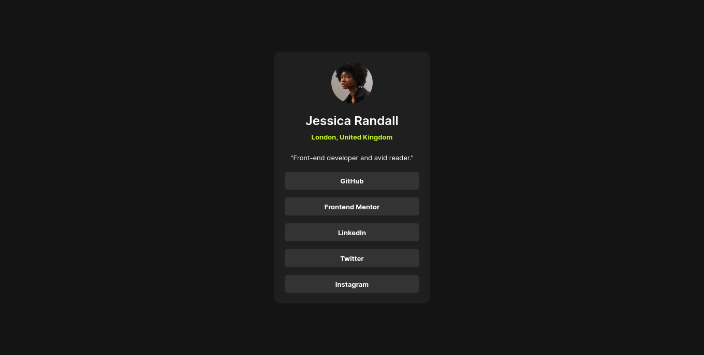
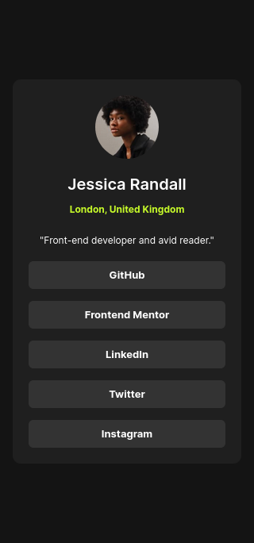

# Frontend Mentor - Solución de perfil de enlaces sociales

Esta es una solución al [desafío de perfil de enlaces sociales en Frontend Mentor](https://www.frontendmentor.io/challenges/social-links-profile-UG32l9m6dQ). Los desafíos de Frontend Mentor te ayudan a mejorar tus habilidades de codificación mediante la creación de proyectos realistas.

## Índice

- [Frontend Mentor - Solución de perfil de enlaces sociales](#frontend-mentor---solución-de-perfil-de-enlaces-sociales)
  - [Índice](#índice)
  - [Descripción general](#descripción-general)
    - [El desafío](#el-desafío)
    - [Captura de pantalla](#captura-de-pantalla)
      - [Desktop Desing](#desktop-desing)
      - [Mobile Desing](#mobile-desing)
    - [Enlaces](#enlaces)
  - [Mi proceso](#mi-proceso)
    - [Creado con](#creado-con)
  - [Autor](#autor)

## Descripción general

### El desafío

Los usuarios deberían poder: - Ver los estados de desplazamiento y enfoque de todos los elementos interactivos de la página

### Captura de pantalla

#### Desktop Desing

#### Mobile Desing

### Enlaces

- URL de la solución: [git](https://github.com/jean266/perfil_enlaces_sociables)
- URL del sitio en vivo: [vercel](https://perfil-enlaces-sociables.vercel.app/)

## Mi proceso

### Creado con

- Marcado HTML5 semántico
- Flujo de trabajo para dispositivos móviles 
- Gulp
- SASS
- NPM

## Autor

- Mentor de frontend: [@jean266](https://www.frontendmentor.io/profile/jean266)